# Predicting Housing Prices in Ames, Iowa

## Problem Statement

Through creating and iteratively refining regression models, this project aims to explore the Ames Housing Dataset to identify which features are best predictors of housing prices. 

## Executive Summary

I am a real estate consultant agent from Iowa Real Estate Company. I will explore and identify important features that are best predictors of housing prices by creating regression models: Linear Regression, Ridge Regresion, Lasso Regression. Understanding the key features will be beneficial to existing home owners who might be considering selling their property to have an idea of what prices their property could sell for and what can they do to maximize sell price. As for potential home buyers, it is useful in terms of having a price range of a house and to adjust bid price accordingly. We could use these findings to understand what are some key predictors in predicting prices for houses in the United States. However, this data set has some features that are very specific to Ames, Iowa (ex. neighborhood), the specific model will not be a good fit for other housing data in the U.S. This presentation and report is geared towards non-technical audiences. 
 

## Data Import and Cleaning
- [train.csv](https://git.generalassemb.ly/schen325/dsir-111/blob/master/projects/project-02/datasets/train.csv): dataset used to model
- [test.csv](https://git.generalassemb.ly/schen325/dsir-111/blob/master/projects/project-02/datasets/test.csv): dataset to make predictions on `saleprice`

The datasets have 82 columns which include 23 nominal, 23 ordinal, 14 discrete, and 20 continuous variables (and 2 additional observation identifiers). 

Detailed data dictionary can be found [here](http://jse.amstat.org/v19n3/decock/DataDocumentation.txt).

Column names changed to lowercase and spaces replace with '_'.

#### Missing Values

Bar plot of missing values of each feature: 

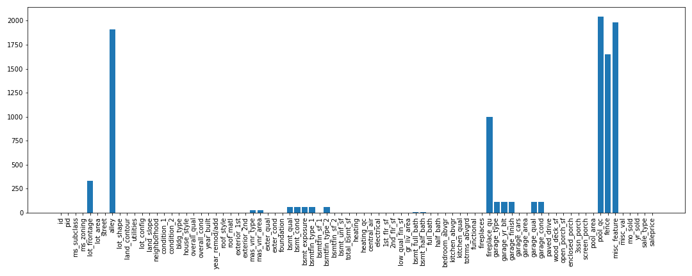

Missing values were observed. Features that have almost or more than 50% missing values: `pool_qc`, `misc_feature`, `alley`, `fence`, and `fireplace_qu`. 

Examine these features: 
- `pool_qc`: pool quality, 99.56 % missing meaning almost all the houses have no pool: drop along with `pool_area`
- `misc_feature`: miscellaneous feature not covered in other categories, 96.83 % meaning no misc features: drop 
- `alley`: type of alley access to property, 93.17% have no alley access: drop
- `fence`: fence quality, 80.49% has no fence: drop
- `fireplace_qu`: fireplace quality, 48.76% which is about half of the houses have no fireplaces: drop along with `fireplaces`

Missing values of numerical features were filled with '0', and missing values of categorical features were filled with 'None'. 

The final dataset is clean and complete with 2040 rows and 13 columns. 

## Dataset Dictionary of `cleaned_train_house.csv`

|Feature|Type|Dataset|Description|
|---|---|---|---|
|id|int|train|Observation number|
|saleprice|int|train|Sale price|
|overall_qual|int|train|Rates the overall material and finish of the house|
|gr_liv_area|float|train|Above grade (ground) living area square feet|
|garage_area|float|train|Size of garage in square feet|
|total_sq_feet|float|train|Size of house in square feet|
|age_of_house|int|train|Age of house when sold|
|total_baths|float|train|The total number of baths|
|neighborhood|object|train|Physical locations within Ames city limits|
|foundation|object|train|The type of foundation|
|exter_qual|object|train|Evaluates the quality of the material on the exterior|
|heating_qc|object|train|Heating quality and condition|
|kitchen_qual|object|train|Kitchen quality|

## Exploratory Data Analysis

Correlation Heatmap of all the numerical features:

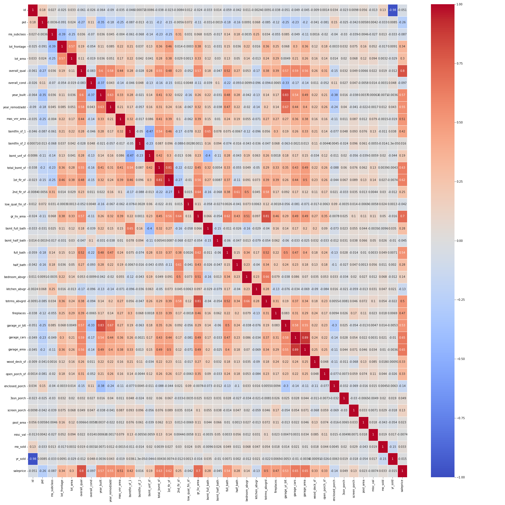

There is multicollinearity in the data. Features that are highly correlated (>.80):
- `year_built` and `garage_yr_blt`
- `gr_liv_area` and `totrms_abvgrd`
- `1st_flr_sf` and `total_bsmt_sf`
- `garage_cars` and `garage_area`

Multicolliniearity has a negative impact on prediction models. So, for each pair of highly correlated features, the feature that has a lower correlation with sale price will be removed. 

Correlation of features with sale price from high to low:

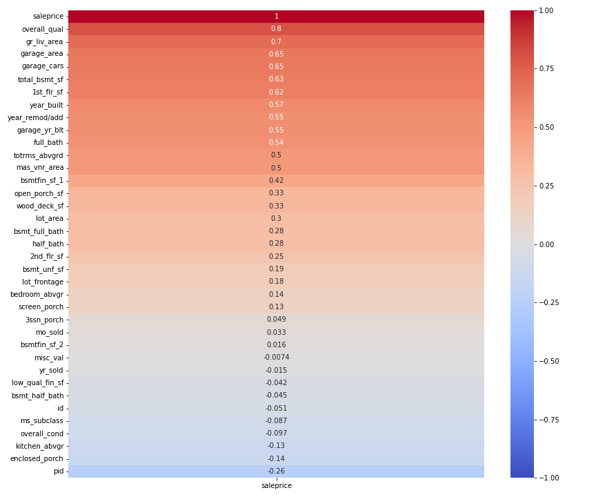

The top ten features that are most correlated with sale price are:  

- `overall_qual`	
- `gr_liv_area`	
- `garage_area`	
- `garage_cars`	
- `total_bsmt_sf`	
- `1st_flr_sf`	
- `year_built`	
- `year_remod/add`	
- `garage_yr_blt`	
- `full_bath`

All these features have >.55 correlation ratio. 

Features with negative correlations:

- `misc_val`	
- `yr_sold`
- `low_qual_fin_sf`	
- `bsmt_half_bath`	
- `id`	
- `ms_subclass`	
- `overall_cond`	
- `kitchen_abvgr`	
- `enclosed_porch`
- `pid`	

Box plot of overall quality: 

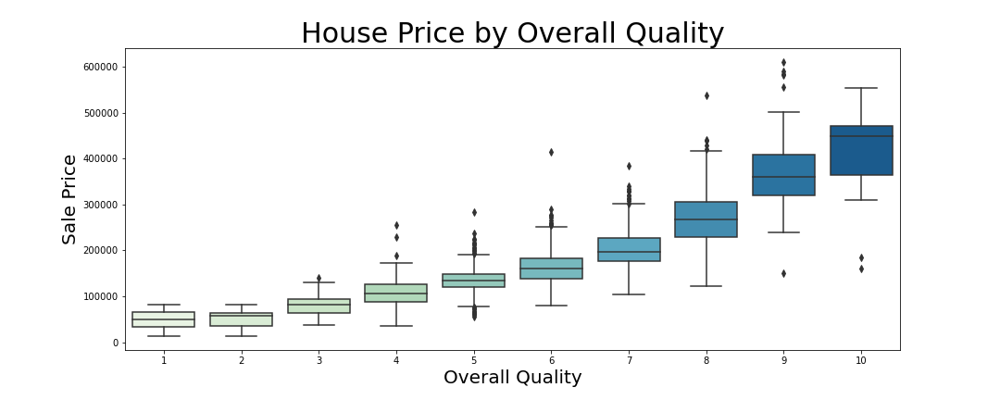

Overall quality rates the overall material and finish of the house with 10 being very excellent and 0 being very poor. This boxplot shows that overall quality plays an important role in determining sale price. The price increases as the overall quality increase.  

Scatterplot of above ground living area: 

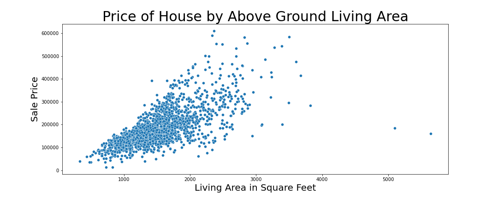

Above ground living area has a linear relationship with sale price. There are couple outliers in the data: two houses with living area greater than 5,000 square feet and sale price lower than $200,000.

Scatterplot of garage area:

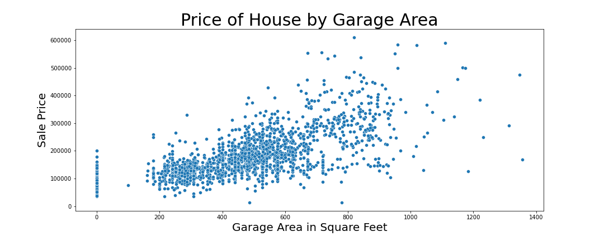

Not looking at houses have have no garages (0 sq.ft), it seems like garage area has a linear relationship with sale price.

Box plot of garage size by car capacity:  

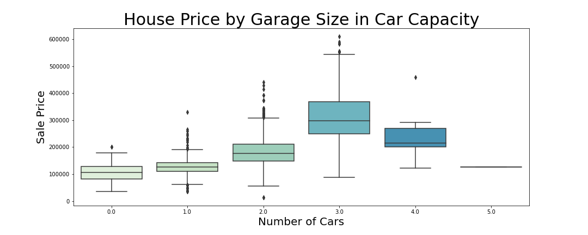

Garage size that can hold 3 cars on average sales more than 4 car garage. 

Scatterplot of basement area:

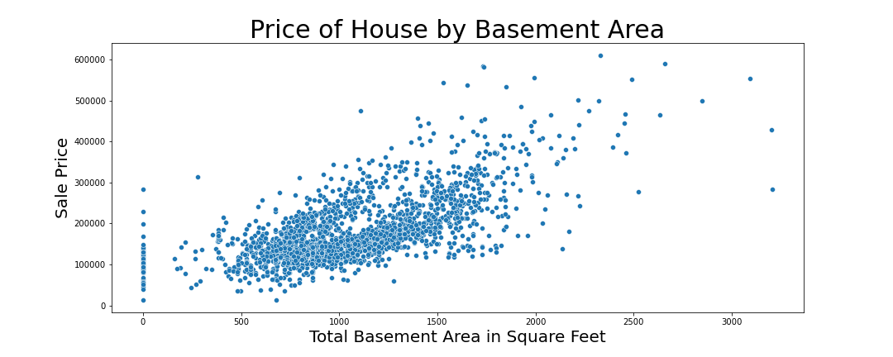

Not considering those houses that have no basement, basement area has a linear relationship with sale price.

Scatterplot of first floor area:

First floor area has a linear relationship with sale price. There are few outliers in the data: three houses with basement area greater than 3,500 square feet and sale price lower than $300,000.

Scatterplot of year built:

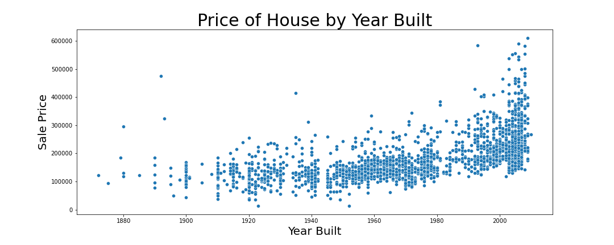

Newer houses have higher average prices. There are few houses that was built before 1900 have a high price.

Scatterplot of remodel date:

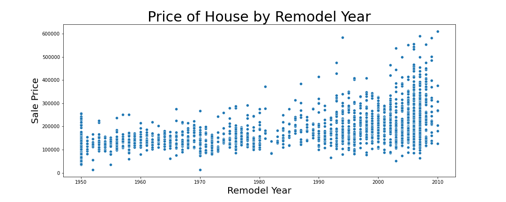

This is similar to the year built, newly remodeled houses have higher average prices.

Box plot of garage built year:

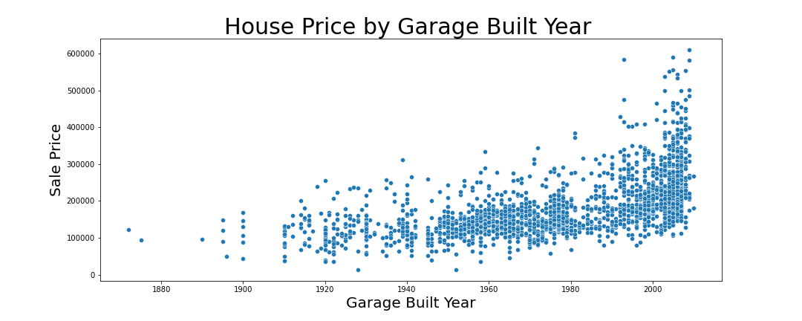

Newer garages sale at higher prices. There is an outlier pass year 2200 which could be an input error.

Box plot of number of full baths:

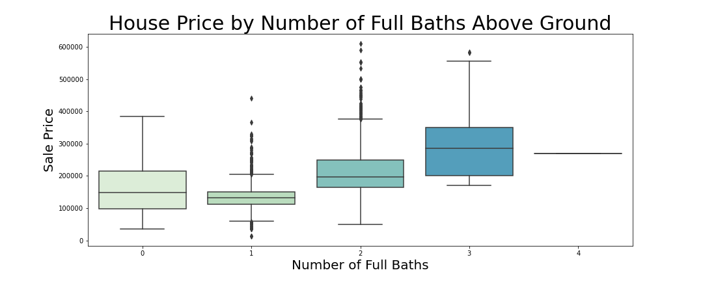

Does seem like as more full baths above ground correlates with higher sale price.

For categorical features, I picked out ones that measures the quality and condition: 

- `exter_qual`
- `exter_cond`
- `bsmt_cond`
- `heating_qc`
- `kitchen_qual`
- `garage_qual`
- `garage_cond`

In addition to those, `neighborhood` and `foundation` was plotted to examine its relationship to `saleprice`.

These were observed: 
- Depending on which neighborhood the house is in, it greatly impacts the sale price. Stone Brook has the highest median price. 
- Poured concrete has the highest median of sale price.
- As the quality of exterior material improves, the sale price increases.
- Similar to exterior material quality, the median is higher when the exterior condition gets better.
- Suprisingly, good and typical(slight dampness allowed) have higher medians than excellent basement quality.
- As heating condition and quality improves, the sale price goes up.
- As kitchen quality improves, the sale price goes up.
- Good and typical/average quality have higher medians than excellent qualities.
- Same with garage quality. Good and typical/average quality have higher medians than excellent qualities. But overall, better conditions yield higher sale price.

Features used in the final modeling: 

- `overall_qual`
- `gr_liv_area`
- `garage_area` 
- `total_sq_feet`: total area of house in sq.ft
- `age_of_house`: age of house when it was sold
- `total_baths`: total number of full (+1) and half (+0.5) baths
- `neighborhood`
- `foundation`
- `exter_qual`
- `heating_qc`
- `kitchen_qual`

## Conclusions and Recommendations

Linear Regression:
- Training R-Squared: 0.8849440796287689
- Testing R-Squared: 0.8855802799348214
- Training RMSE: 27057.54797683163
- Testing RMSE: 25715.830137985067

Ridge Regression:
- Ridge Training R-Squared: 0.8848973869319434
- Ridge Testing R-Squared: 0.8861595511942179
- Training RMSE: 27063.037749662515
- Testing RMSE: 25650.651936249382

Lasso Regression: 
- Ridge Training R-Squared: 0.8849438825113928
- Ridge Testing R-Squared: 0.8855965502348428
- Training RMSE: 27076.243291646442
- Testing RMSE: 25600.47845049716

Through data cleaning, EDA, feature engineering, scaling, and one-hot encoding, Linear Regression model performed the best out of the three models. The models were evaluated on the R-squared score. The R-squared scores for the training set for all three models were lower than the testing set by small numbers. Linear regression was the best one since the difference in the R-squared scores was only .0006. The R-squared score for the testing set was 0.8855 meaning that 88.55% of the variability in `saleprice` can be explained by the X's (features/predictors) in our model (relative to a model with no predictors). The baseline sale price for a house with '0' in those features is $181,665.70.

Features that have high Linear Coefficients:

- `total_sq_feet`
- `overall_qual`
- `garage_area`
- `gr_liv_area`
- `total_baths`

Buyers/sellers: 

- Improving the features of the house. For example, having excellent kitchen and overall quality is correlated with higher prices
- Take into consideration the location of the home 
- Renovate the house if budget allows

Property investors: 

- Investing in houses with a large living area
- Investing houses that are already in great or excellment conditions (interior and exterior), or consider renovation
- Investing in higly ranked neighborhoods or homes in higher ranking cities 

